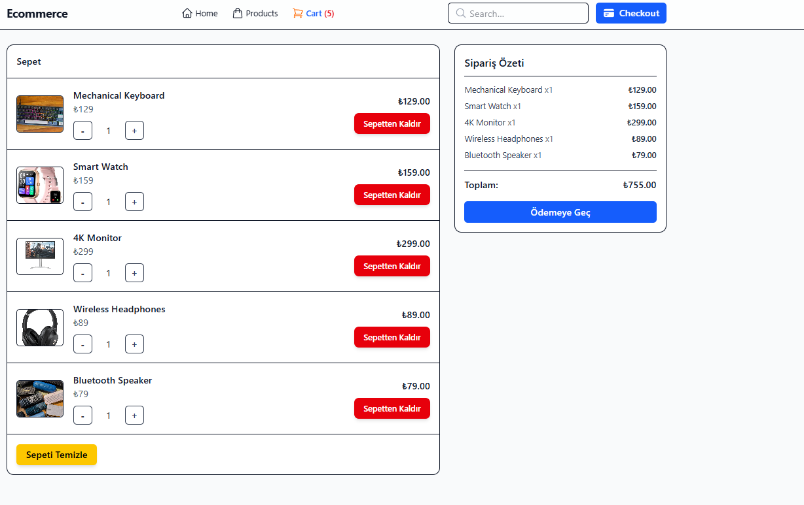
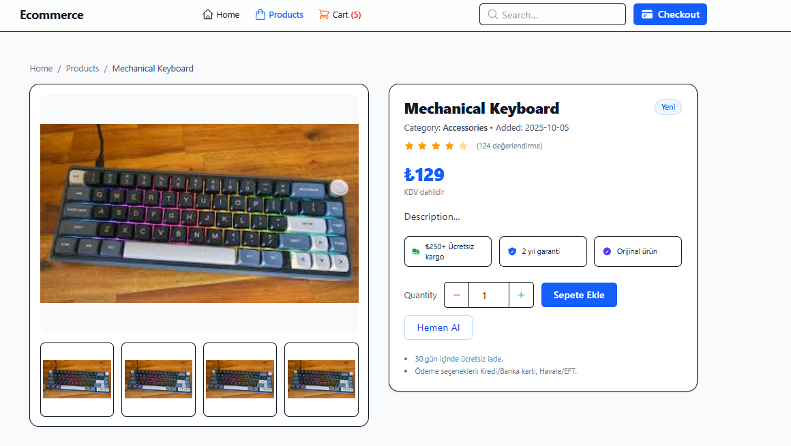

# 🛍️ React E-Commerce

Modern, hızlı ve şık bir e-ticaret uygulaması. React, Tailwind CSS ve Context API kullanılarak oluşturuldu.

---

## 🚀 Özellikler
- Ürün listeleme, filtreleme ve detay sayfaları  
- Sepet yönetimi (Context API)  
- React Router ile sayfa yönlendirmesi  
- Tailwind CSS ile modern tasarım  
- React Toastify ile bildirim sistemi  

---

## 🧩 Kullanılan Teknolojiler
- React 18 (Vite ile oluşturuldu)  
- Tailwind CSS  
- React Router DOM  
- React Toastify  
- Context API  

---

## 🖼️ Ekran Görüntüleri

### 🏠 Ana Sayfa


### 🛒 Ürünler Sayfası


### 🧺 Sepet Sayfası


### 🎧 Ürün Detayı


---

## ⚙️ Kurulum

```bash
# Bağımlılıkları yükle
npm install

# Uygulamayı çalıştır
npm run dev
